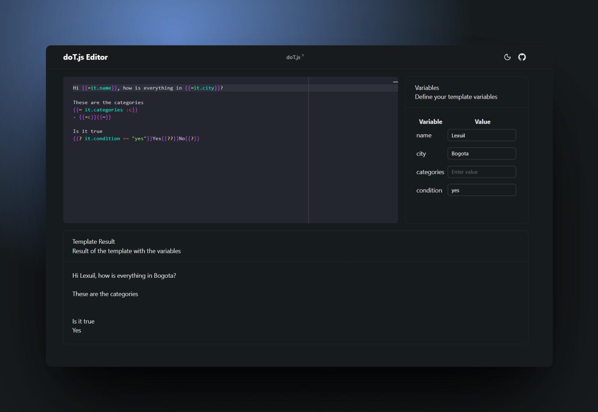

# doT.js Editor

A browser-based editor for writing and testing [doT.js templates](https://olado.github.io/doT/index.html) with live variable extraction and instant rendering.



## Features

- doT syntax highlighting powered by Monaco + Shiki
- Automatic variable detection from template expressions (for example `it.name`, `it.city`)
- Dynamic variable form generation to quickly test data values
- Live rendered output preview
- Light/dark theme support

## Tech Stack

- Vue 3 + TypeScript
- Vite+ toolchain (`vp`)
- Nuxt UI components
- Monaco Editor
- Shiki syntax highlighting
- doT.js template engine

## Requirements

- Node.js 24
- Bun 1.3+ (managed through your local setup)
- `vp` CLI available globally

## Getting Started

1. Install dependencies:

```bash
vp install
```

2. Start development server:

```bash
vp dev
```

3. Open the app in your browser (default Vite URL is usually shown in terminal output).

## Available Commands

```bash
vp dev        # start development server
vp build      # create production build
vp preview    # preview production build
vp lint       # lint source files
vp check      # run format + lint + type checks through Vite+
vp test       # run tests (when test files are present)
```

## How to Use

1. Write a doT template in the editor panel.
2. Add expressions using `it.<variableName>`.
3. Fill generated variable inputs in the Variables panel.
4. Read the rendered result in the Template Result panel.

### Example Template

```dot
Hi {{=it.name}}, welcome to {{=it.city}}!

{{? it.isMember == "yes" }}
Thanks for being a member.
{{??}}
Join us to unlock member benefits.
{{?}}
```

Detected variables: `name`, `city`, `isMember`.

## Project Structure

```text
src/
	components/      # UI pieces (editor container, variables form, output view)
	composables/     # editor state and variable extraction logic
	lib/             # custom doT TextMate grammar
	views/           # route-level pages
```
